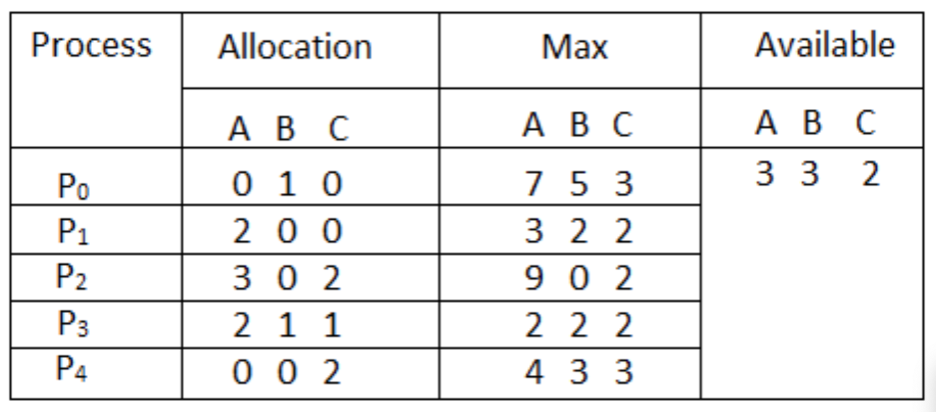

# The Banker's Algorithm Problem
## Assignment:
    Considering a system with five processes P0 through P4 and three resources of type A, B, C. Resource type A has 10 instances, B has 5 instances and type C has 7 instances. Suppose at time t0 following snapshot of the system has been taken:

    Implement the Banker’s algorithm to answer the following question： Is the system in a safe state? If Yes, then what is the safe sequence?

## Implementation:
    I first initialized the given allocation matrix, max matrix, and work vector, then followed the Banker's Algorithm to find the need matrix and then compared each line to the work vector. This allows for a systematic comparison to check if the sequence is safe or not.

## Results:
    As of right now the input is still hard coded, I will update with the dynamic input option.